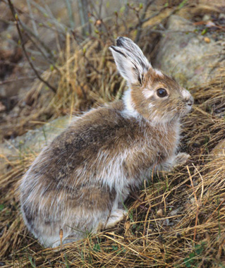

```{r setup, include=FALSE}
knitr::opts_chunk$set(echo = F,
                      warnings = F,
                      messages = F)
```


```{r, include=F}
# add packages -------------------------------------------

library(tidyverse)
library(here)
library(lubridate)
library(kableExtra)

# add data -----------------------------------------------

hares <- read_csv(here::here("Data", "showshoe_lter.csv")) 


```

# Introduction 

Capture-recapture studies were carried out in Bonanza Creek Experimental Forest in Alaska to monitor populations of a keystone prey species, the snowshoe hare (*Lepus americanus*)^1^.Studies have taken place in five locations in the Tanana Valley since 1998, however available data only includes information from  1998 - 2012 (Figure 1). Data such as sex, age, and weight were documented. For more information on collection methods and spatial information, please see the [metadata](https://portal.lternet.edu/nis/metadataviewer?packageid=knb-lter-bnz.55.22). 

<br>

<center>



<br> 

**Figure 1:** Snowshoe hare (*Lepus americanus*) transitioning from a winter to spring coat. Photo credit: [USFWS](https://www.fws.gov/refuge/Tetlin/wildlife_and_habitat/snowshoe_hare.html) 


<br>

# Bonanza Creek Snowshoe Hare Population
```{r fig.align='center'}
# subdata------------------------------------------------

hares_sub <- hares %>% 
  select(date, sex, weight) %>% 
  drop_na () %>% 
  mutate (sex = str_to_lower(sex)) %>% 
  filter (sex %in% c("m", "f")) %>% 
  mutate (date = lubridate::mdy(date)) %>% 
  mutate (year = lubridate::year(date),
          month = lubridate::month(date))

# summary ----------------------------------------------

hares_mean <- hares_sub %>% 
  group_by(year,sex) %>% 
  summarise(mean_weight = mean(weight))

# graph -------------------------------------------------

ggplot(hares_mean, aes(x = year, y = mean_weight)) +
  geom_point(aes(color = sex)) +
  geom_line(aes(color = sex)) +
  theme_minimal() +
  labs (x = "\nYear", 
        y = "Mean Weight (g)\n",
        title = "Snowshoe Hare Mean Weights") +
  scale_x_continuous(lim = c(1998, 2012),
                     expand = c(0,0),
                     breaks = seq(1998, 2012, by = 2)) +
  scale_y_continuous(lim = c(1000, 1800),
                     expand = c(0,0)) +
  scale_color_discrete(name = "Sex", labels = c("Female", "Male"))

```
***Figure 2:** Annualfluctuations in mean weights of male and female snowshoe hares (*Lepus americanus*). Data: Bonanza Creek LTER.*

<br>

# Summary Statistics of Snowshoe Hares 

***Table 1:** Annual Summary statistics amd sample size of snowshoe hare (*Lepus americanus*) weights. Data: Bonanza Creek LTER.*
```{r}

hares_summary_stats <- hares_sub %>% 
  group_by(year) %>% 
  summarise(sample_size = n(),
            mean_weight = mean(weight),
            min_weight = min(weight),
            max_weight = max(weight),
            sd_weight = sd(weight),
            se_weight = sd(weight/sqrt(n()))
            )

hares_summary_stats %>% kable(col.names = c("Year", "Sample Size", "Mean", "Minimum", 
                    "Maximum", "Standard Deviation", "Standard Error"), align = "c") %>% 
  kable_styling (bootstrap_options = c("striped", "hover", "condensed", "responsive"), 
    full_width=T,
    position="center") %>% 
  add_header_above(c("Summary Statistics of Snowshow Hare Weights (g)" = 7))


```

<br>

# Citations

1. Kielland, Knut; Chapin, F. Stuart; Ruess, Roger W. 2017. Snowshoe hare physical data in Bonanza Creek Experimental Forest: 1999-Present, Bonanza Creek LTER - University of Alaska Fairbanks. BNZ:55, http://www.lter.uaf.edu/data/data-detail/id/55. doi:10.6073/pasta/03dce4856d79b91557d8e6ce2cbcdc14
